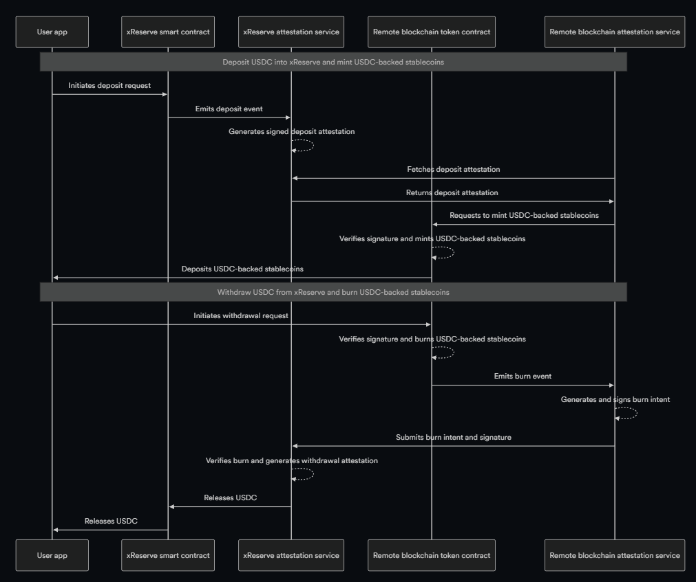

# Gambaran Umum _xReserve_

**_xReserve_** adalah infrastruktur interoperabilitas yang memungkinkan para pengembang _blockchain_ untuk menerbitkan _stablecoin_ berbasis USDC di jaringan mereka sendiri. Sistem ini didukung oleh pengesahan terprogram (_programmatic attestations_) dan _smart contract_ yang diimplementasikan oleh _Circle_ yang menyimpan USDC sebagai cadangan di _source blockchain_ seperti Ethereum. _Stablecoin_ berbasis USDC dicetak melalui _xReserve_ dapat saling berinteraksi serta dengan jaringan USDC yang lebih luas.

## Manfaat Utama

_xReserve_ menawarkan berbagai manfaat bagi jaringan _blockchain_, para pengembang, dan pengguna akhir:

- **Likuiditas hari pertama:** Token yang dicetak menggunakan _xReserve_ terhubung dengan jaringan USDC yang lebih luas, sehingga pengguna dapat dengan mudah memindahkan token antar _blockchain_.

- **Interoperabilitas:** Pengguna dapat melakukan transfer 1:1 antara _stablecoin_ berbasis USDC dan USDC.

- **Diimplementasikan oleh _Circle_:** _xReserve_ menyimpan cadangan USDC dalam _smart contract_ yang diimplementasikan oleh _Circle_.

- **Asumsi kepercayaan yang diminimalkan:** Mekanisme pengesahan _xReserve_ memverifikasi proses deposit dan pembakaran token (_burn_), sehingga mengurangi ketergantungan pada layanan pihak ketiga untuk mengonversi USDC.

# Pendahuluan

## Cara Kerja _xReserve_

_xReserve_ terdiri dari dua layanan utama: _smart contract_ _onchain_ dan sistem pengesahan _offchain_. Secara bersama-sama, kedua layanan ini beserta layanan terkait di _remote blockchain_ memungkinkan pengguna untuk mendepositkan (_deposit_) USDC di _source blockchain_ guna menerima _stablecoin_ berbasis USDC di _remote blockchain_. Selanjutnya, pengguna dapat membakar _stablecoin_ berbasis USDC untuk menarik kembali (_withdrawal_) USDC yang disimpan dalam _xReserve_.

Berikut adalah diagram yang menunjukkan bagaimana _xReserve_ menangani proses _deposit_ dan _withdrawal_.

## Proses _Deposit_ ke _xReserve_

Langkah-langkah berikut terjadi ketika pengguna mendepositkan USDC ke _xReserve_:

1. Pengguna mendepositkan USDC dari aplikasi _wallet_ mereka ke _smart contract_ _xReserve_ di _source blockchain_.
2. Kontrak _xReserve_ memancarkan peristiwa deposit, mengunci dana tersebut, dan menahannya sebagai cadangan.
3. Layanan pengesahan _xReserve_ menghasilkan dan menandatangani bukti pengesahan deposit.
4. Layanan pengesahan _remote blockchain_ mengambil bukti pengesahan deposit yang telah ditandatangani.
5. _remote blockchain_ mencetak _stablecoin_ berbasis USDC di jaringannya dan memancarkan peristiwa mint.
6. Kontrak token di _remote blockchain_ mendepositkan _stablecoin_ yang baru dicetak ke aplikasi _wallet_ pengguna di _remote blockchain_ tersebut.

Setelah proses deposit selesai, pengguna menerima _stablecoin_ berbasis USDC dalam jumlah yang setara di _remote blockchain_.

## Proses _Withdrawal_ dari _xReserve_

Selanjutnya, langkah-langkah berikut ini terjadi ketika pengguna menarik USDC dari _xReserve_:

1. Pengguna mengajukan pembakaran _stablecoin_ berbasis USDC di _remote blockchain_ serta _withdrawal_ USDC di _destination blockchain_.
2. Kontrak token yang ada di _remote blockchain_ membakar _stablecoin_ berbasis USDC dan memancarkan peristiwa pembakaran.
3. Layanan pengesahan di _remote blockchain_ menghasilkan dan menandatangani pernyataan niat pembakaran secara _offchain_.
4. Layanan pengesahan di _remote blockchain_ meneruskan niat pembakaran beserta tanda tangannya ke _xReserve_.
5. _xReserve_ memverifikasi pembakaran tersebut dan menerbitkan pengesahan _withdrawal_.
6. _xReserve_ melepaskan USDC ke dompet pengguna di _destination blockchain_.

Setelah proses _withdrawal_ selesai, pengguna menerima USDC di _source blockchain_.
